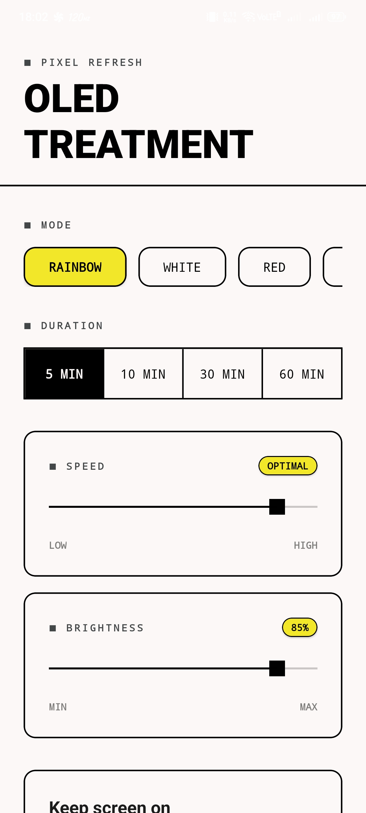
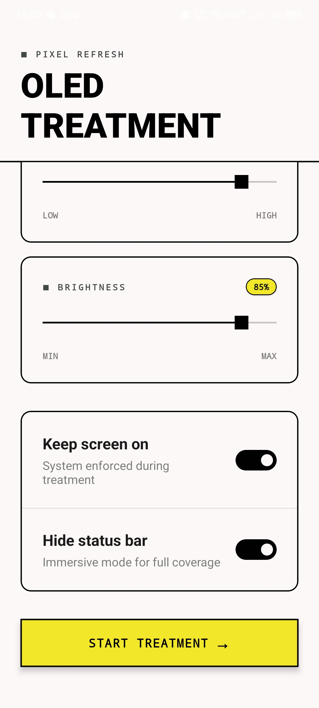
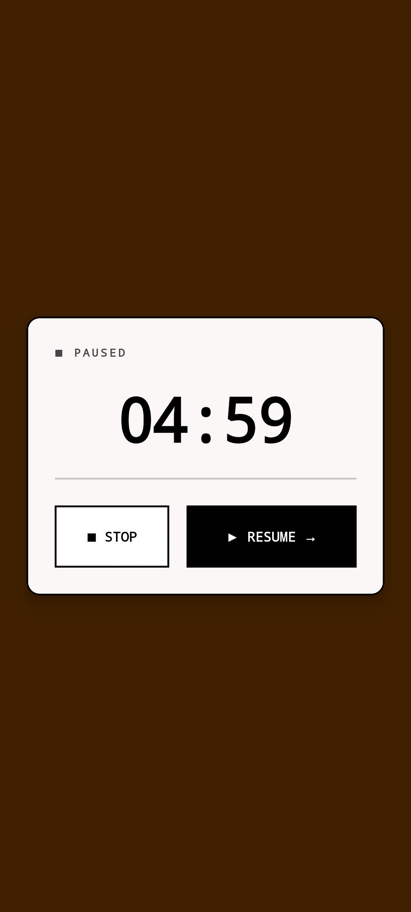

<p align="center">
  <h1 align="center">Pixel Refresh</h1>
  <p align="center">
    <strong>OLED screen maintenance & pixel refresh tool</strong>
  </p>
  <p align="center">
    <a href="#features">Features</a> •
    <a href="#screenshots">Screenshots</a> •
    <a href="#getting-started">Getting Started</a> •
    <a href="#building">Building</a> •
    <a href="#cicd">CI/CD</a>
  </p>
</p>

<p align="center">
  
  
  
  
</p>

---

## About

**Pixel Refresh** is a professional pixel refresh and screen maintenance tool for OLED displays. It helps reduce screen burn-in and image retention by cycling through carefully calibrated color patterns at configurable speeds.

Built with **React Native + Expo** using **TypeScript strict mode** and **custom UI components only** — no external UI libraries.

---

## Screenshots

<p align="center">
  
  &nbsp;&nbsp;
  
  &nbsp;&nbsp;
  
</p>

<p align="center">
  <em>Settings Screen (top & bottom) • Treatment Session (paused)</em>
</p>

---

## Features

| Feature | Description |
|---------|-------------|
| **7 Treatment Modes** | Rainbow, White, Red, Green, Blue, Grayscale, Pixel Walk |
| **Adjustable Duration** | 5, 10, 30, or 60 minute sessions |
| **Speed Control** | Fine-tune color cycling speed from Low to Optimal |
| **Brightness Control** | Set display brightness from 0% to 100% |
| **Keep Screen On** | Prevents screen timeout during treatment |
| **Hide Status Bar** | Full immersive mode for complete coverage |
| **Pause & Resume** | Tap to pause with countdown timer display |
| **Auto-Complete** | Automatically returns to settings when timer ends |

---

## Tech Stack

| Layer | Technology |
|-------|-----------|
| **Framework** | React Native + Expo (SDK 52) |
| **Language** | TypeScript (strict mode) |
| **Navigation** | expo-router (file-based) |
| **UI** | Custom components — no UI library |
| **Screen Control** | expo-keep-awake, expo-brightness, expo-status-bar |
| **Gestures** | react-native-gesture-handler |
| **Animations** | react-native-reanimated, Animated API |

---

## Getting Started

### Prerequisites

- **Node.js** >= 18
- **Expo CLI** — `npx expo` (included with npx)
- **EAS CLI** — `npm i -g eas-cli` (for native builds)

### Installation

```bash
# Clone the repository
git clone https://github.com/thienbd203/pixel-refresh.git
cd pixel-refresh

# Install dependencies
npm install

# Start the development server
npx expo start
```

Press `a` for Android, `i` for iOS, or `w` for web.

---

## Project Structure

```
pixel-refresh/
├── app/
│   ├── _layout.tsx          # Root layout (Stack navigator)
│   ├── index.tsx            # Settings screen
│   └── session.tsx          # Full-screen treatment screen
├── components/
│   ├── ModeChip.tsx         # Mode selection chip
│   ├── DurationPicker.tsx   # Duration option picker
│   ├── SliderControl.tsx    # Labeled slider with badge
│   ├── Slider.tsx           # Custom pan-based slider
│   └── ToggleRow.tsx        # Toggle switch row
├── assets/
│   └── screenshots/         # App screenshots
├── .github/workflows/
│   ├── lint.yml             # TypeScript type-check
│   └── eas-build.yml        # EAS Build automation
├── app.json                 # Expo configuration
├── eas.json                 # EAS Build profiles
└── tsconfig.json            # TypeScript configuration
```

---

## Building

### Development Build

```bash
# Android
npx expo run:android

# iOS
npx expo run:ios
```

### Production Build (EAS)

```bash
# Android APK/AAB
eas build --platform android --profile production

# iOS IPA
eas build --platform ios --profile production

# Preview build (APK for testing)
eas build --platform android --profile preview
```

### Web Export

```bash
npm run build:web
```

---

## CI/CD

Automated pipelines are configured via GitHub Actions:

| Workflow | Trigger | Description |
|----------|---------|-------------|
| **Lint** (`lint.yml`) | Every push & PR | TypeScript type-check (`tsc --noEmit`) |
| **EAS Build** (`eas-build.yml`) | Push to `main` | Builds Android APK via EAS Build |

### Setup

To enable automated builds, add the `EXPO_TOKEN` secret to your repository:

1. Generate a token at [expo.dev/settings/access-tokens](https://expo.dev/accounts/[account]/settings/access-tokens)
2. Go to **Repository Settings** → **Secrets and variables** → **Actions**
3. Add `EXPO_TOKEN` with your token value

> **Note:** If `EXPO_TOKEN` is not configured, the build step is skipped gracefully — CI will still pass.

---

## License

This project is private and proprietary.
